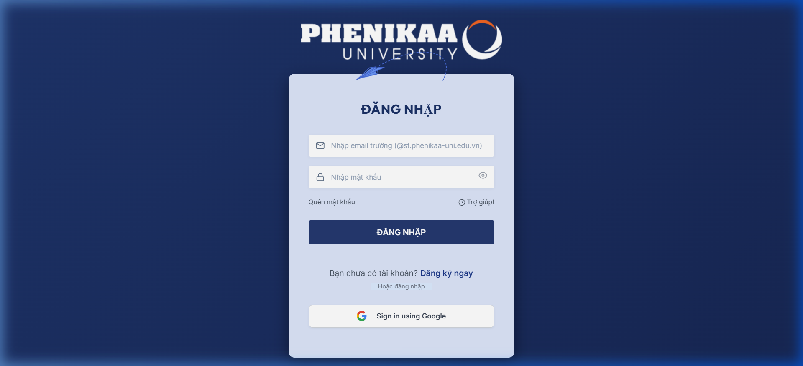
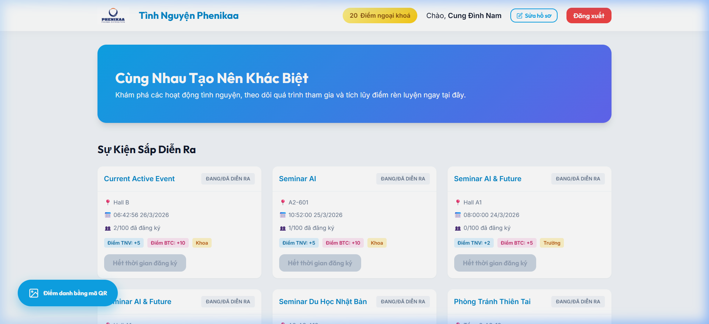
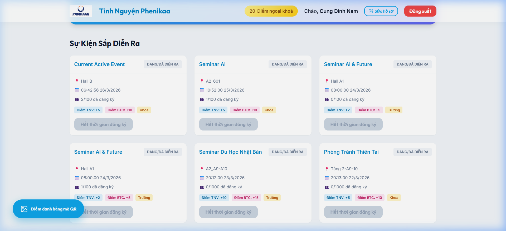
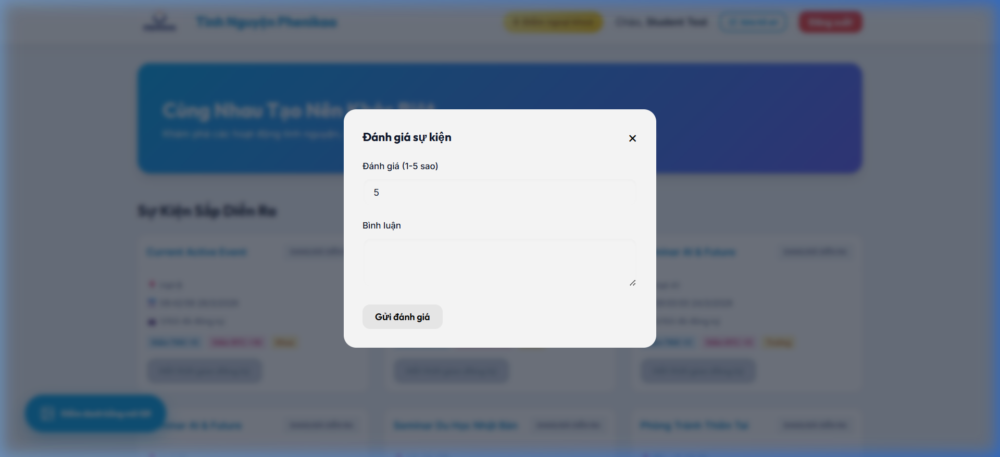
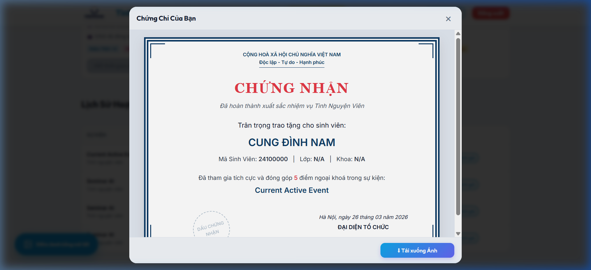
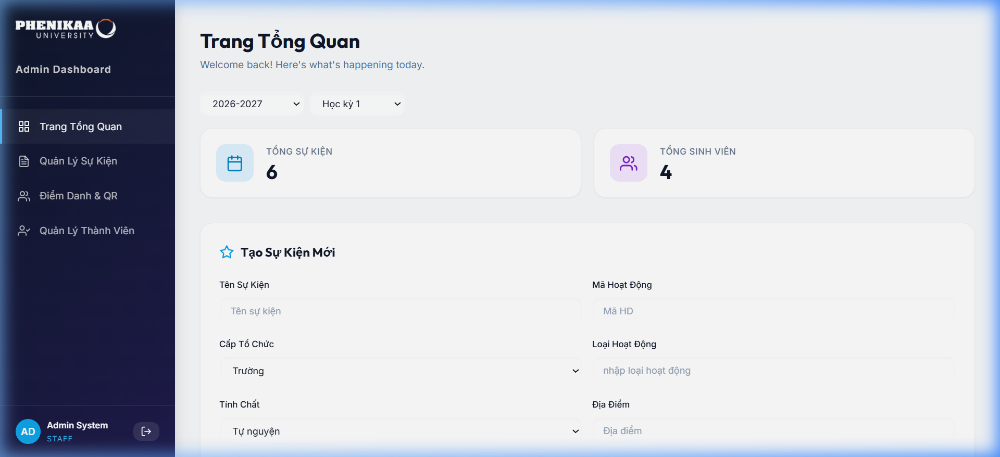
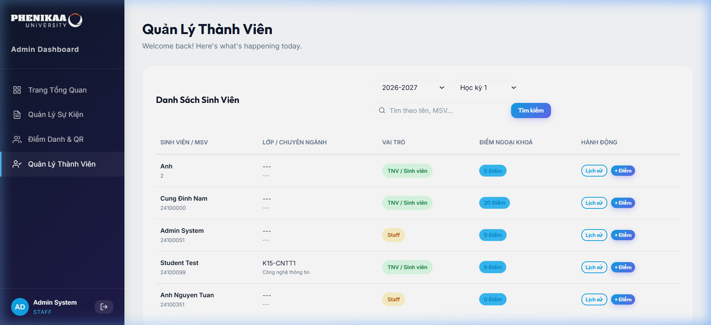
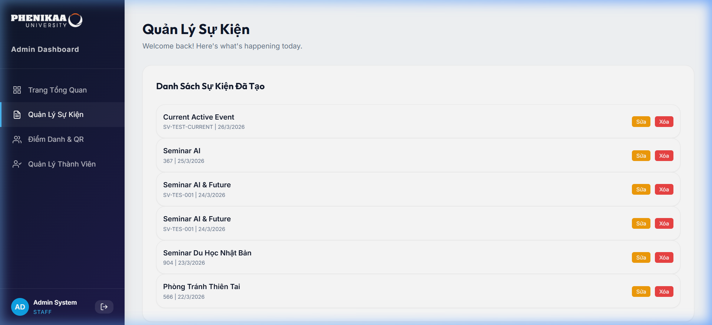

# 🌟 Phenikaa Volunteer Management System (PHVMS)

> **Hệ thống Quản lý Hoạt động Tình nguyện Sinh viên**  
> Dự án môn kỹ thuật phần mềm

PHVMS là một nền tảng quản lý tình nguyện tập trung, được thiết kế để kết nối Ban tổ chức (Staff) và Sinh viên (Volunteer), giúp tự động hóa quy trình từ đăng ký, điểm danh đến cấp chứng nhận và thu thập phản hồi.

---

##  Tính Năng Nổi Bật

###  Đối với Sinh viên (Volunteer Portal)
- **Dashboard Cá nhân**: Theo dõi tổng điểm ngoại khóa tích lũy thời gian thực.
- **Khám phá Sự kiện**: Xem danh sách các hoạt động đang và sắp diễn ra với đầy đủ thông tin (địa điểm, thời gian, mô tả).
- **Đăng ký Trực Tuyến**: Đăng ký tham gia chỉ với 1 click chuột.
- **Điểm danh QR Code**: Check-in siêu tốc bằng camera điện thoại thông qua mã QR duy nhất của sự kiện.
- **Feedback & Đánh giá**: Tự động hiển thị form đánh giá sau khi điểm danh thành công để cải thiện chất lượng hoạt động.
- **Chứng nhận Tự động**: Xem và tải ảnh Chứng chỉ (PNG) trực tiếp sau khi hoàn thành nhiệm vụ.

###  Đối với Ban tổ chức (Admin & Staff Dashboard)
- **Quản lý Sự kiện**: Tạo mới, chỉnh sửa và quản lý trạng thái các hoạt động (Đang diễn ra, Đã kết thúc, Đã hủy).
- **Quản lý Sinh viên**: Theo dõi danh sách đăng ký, phân vai trò (Volunteer/Organizer) và quản lý điểm số.
- **Mã QR Động**: Tự động sinh mã QR định danh cho từng sự kiện với cơ chế bảo mật ValidationData.
- **Thống kê & Báo cáo**: Xuất danh sách tình nguyện viên tham gia (Check-in list).

---

##  Giao Diện Thực Tế

### 1. Hệ thống Đăng nhập (Authentication)
Giao diện đăng nhập hiện đại với hiệu ứng Glassmorphism, hỗ trợ cả đăng nhập thông thường và Google Login.


### 2. Dashboard Sinh viên (Volunteer Portal)
Nơi sinh viên theo dõi điểm tích lũy và các hoạt động cá nhân.


### 3. Đăng ký & Khám phá Sự kiện
Danh sách các sự kiện tình nguyện đang diễn ra, chi tiết thông tin và nút đăng ký nhanh.


### 4. Điểm danh QR & Feedback Tức thì
Cơ chế điểm danh thông minh qua mã QR, tự động mở form đánh giá ngay sau khi thành công.


### 5. Chứng Chỉ Tham Gia
Chứng chỉ điện tử được cấp tự động sau khi kết thúc sự kiện, có tính năng tải về (PNG).


### 6. Dashboard Quản trị (Admin Dashboard)
Tổng quan số liệu thống kê về tình nguyện viên và sự kiện toàn trường.


### 7. Quản lý Thành viên & Điểm số (Admin)
Admin có thể kiểm soát danh sách sinh viên, cộng điểm rèn luyện và xem lịch sử chi tiết.


### 8. Quản lý Sự kiện & QR Code (Admin)
Giao diện quản lý danh sách sự kiện, cập nhật trạng thái và sinh mã QR check-in.


---

## 🛠 Công Nghệ Sử Dụng

| Thành phần | Công nghệ |
| :--- | :--- |
| **Backend** | Node.js, Express.js |
| **Frontend** | HTML5, JavaScript (ES6+), CSS3 (Custom Design) |
| **Cơ sở dữ liệu** | MySQL (PlanetScale/Local) |
| **Libraries** | `mysql2`, `qrcode`, `html5-qrcode`, `html2canvas`, `cors`, `dotenv` |

---

## 📂 Cấu Trúc Dự Án

```text
QLYTNV/
├── frontend/               # Mã nguồn giao diện người dùng
│   ├── index.html          # Cổng thông tin cho sinh viên
│   ├── admin.html          # Bảng điều khiển admin/staff
│   ├── auth.html           # Trang đăng nhập/đăng ký
│   ├── css/                # Stylesheets tùy chỉnh
│   └── js/                 # Logic JavaScript phía client
├── src/                    # Mã nguồn backend
│   ├── config/             # Cấu hình Database
│   ├── controllers/        # Xử lý logic nghiệp vụ
│   ├── routes/             # Định nghĩa API endpoints
│   └── helper/             # Các hàm tiện ích
├── models/                 # Chứa các lớp đối tượng (OOP)
├── database/               # Scripts khởi tạo DB (.sql)
└── index.js                # Điểm khởi chạy ứng dụng
```

---

## ⚡ Khởi Chạy Nhanh (Khuyên dùng)

> Double-click vào file **`start.bat`** — server sẽ tự khởi động và trình duyệt sẽ tự mở tại `http://localhost:5000`.
> *(Script tự cài đặt `node_modules` nếu chưa có)*

---

## 🔧 Hướng Dẫn Cài Đặt (Thủ công)

### 1. Chuẩn bị
- Node.js (v14+)
- MySQL Server

### 2. Các bước thực hiện
```bash
# Clone project
git clone <url-du-an>
cd QLYTNV

# Cài đặt thư viện
npm install

# Tạo file .env dựa trên template (.env.example)
cp .env.example .env

# Sửa các thông số trong .env cho phù hợp với môi trường của bạn
PORT=5000
DB_HOST=localhost
DB_USER=root
DB_PASS=yourpassword
DB_NAME=qlytnv
```

### 3. Khởi tạo Cơ sở dữ liệu (Database)
Bạn có thể chọn một trong hai cách sau:
- **Cách 1 (Tùy chọn)**: Sử dụng kịch bản Migration có sẵn để tự động tạo bảng và dữ liệu mẫu:
  ```bash
  node database/migrate.js
  ```
- **Cách 2**: Import trực tiếp file SQL vào MySQL:
  Sử dụng file `database/quanlytnv.sql`.

### 4. Khởi chạy Ứng dụng
```bash
# Chạy ở chế độ development
node index.js
```
Ứng dụng sẽ khả dụng tại: `http://localhost:5000`

---

## Tài khoản test (Demo) 

| Vai trò | Email | Mật khẩu |
| :--- | :--- | :--- |
| **Student** | `24100000@st.phenikaa-uni.edu.vn` | `tinhnguyenvien123` |
| **Staff** | `24100051@st.phenikaa-uni.edu.vn` | `admin123` |

---

---

---
⚡ *Dự án hướng tới mục tiêu tối ưu hóa phong trào tình nguyện tại trường học thông qua chuyển đổi số.*
